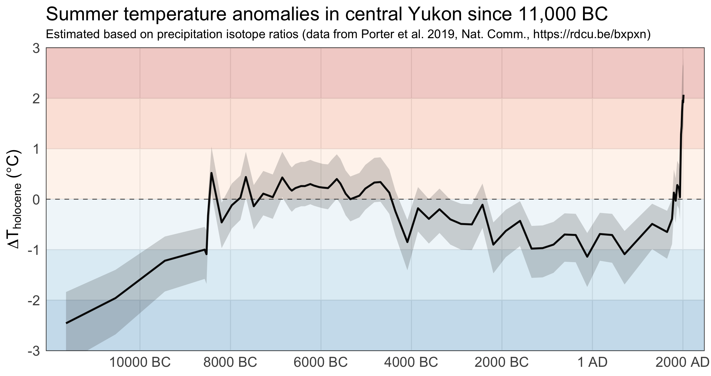

A 13,000-year reconstruction of summer temperature anomalies in central Yukon, Canada, using data from [Porter et al. (2019)](https://doi.org/10.1038/s41467-019-09622-y). Plot inspired by [xkcd.com/1732/](https://xkcd.com/1732/).

